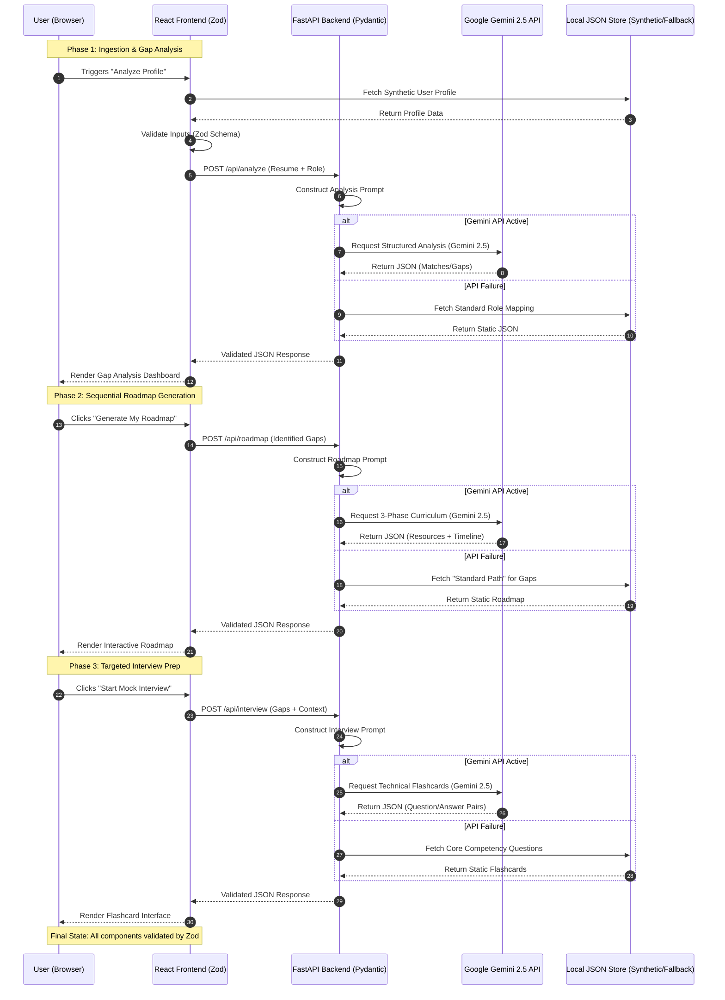

# Design Documentation: Skill-Bridge AI Career Navigator

## 1. Project Overview
**Skill-Bridge** is an AI-powered career development platform built for Scenario 2 of the Palo Alto Networks assessment. It bridges the gap between a candidate's current skill set and their target job description by providing an automated Gap Analysis, a dynamically generated Learning Roadmap, and an interactive Mock Interview environment.

The core engineering philosophy behind this project was **resilience, strict data integrity, and token efficiency.**

## 2. Technical Stack

### Frontend
* **Framework:** React.js (Bootstrapped with Vite for optimized build times and HMR).
* **Styling:** Tailwind CSS (For rapid, utility-first responsive design).
* **Validation:** Zod (For strict client-side schema validation before making network requests).
* **Testing:** Vitest (For fast, native unit and component testing).

### Backend
* **Framework:** FastAPI (Python) (Chosen for its async capabilities and native OpenAPI documentation).
* **AI Integration:** Google Gemini 2.5 Flash via LangChain.
* **Data Validation:** Pydantic (Ensures strict type-checking and guarantees structured JSON outputs from the LLM).
* **Environment Management:** Python `venv` and `python-dotenv`.

---

## 3. System Architecture & Flow
The application follows a decoupled client-server architecture. 

1. **Client State:** The React frontend manages the user's profile state (synthetic resume data) and target job selection.
2. **Sequential API Routing:** The frontend communicates with the FastAPI backend via three distinct REST endpoints (`/api/analyze`, `/api/roadmap`, `/api/interview`).
3. **LLM Orchestration:** FastAPI utilizes LangChain to wrap the Gemini API. LangChain's `StructuredOutputParser` forces the LLM to return data that perfectly matches predefined Pydantic models.
4. **Response Handling:** The validated JSON is sent back to the client, parsed by Zod, and rendered in the UI.

---

---

## 4. API Specification

The backend exposes three isolated REST endpoints to manage the sequential workflow:

| Endpoint | Method | Payload | Description |
| :--- | :--- | :--- | :--- |
| `/api/analyze` | `POST` | `{ resume_data, job_role }` | Compares skills and returns a JSON list of matches and gaps. |
| `/api/roadmap` | `POST` | `{ missing_skills }` | Generates a 3-phase learning curriculum with stable documentation links. |
| `/api/interview` | `POST` | `{ missing_skills, job_role }` | Generates technical flashcards with hidden answers based on identified gaps. |

---

## 5. Key Design Decisions & Trade-offs

Given the strict 4–6 hour timebox, several strategic engineering decisions were made to prioritize core logic, reliability, and automated testing over DevOps boilerplate.

### A. Sequential API Calls vs. Monolithic Prompting
* **Decision:** Instead of sending one massive prompt to generate the analysis, roadmap, and interview questions simultaneously, the system uses three isolated, user-triggered API calls.
* **Rationale:** 
  1. **Token Efficiency:** Minimizes token consumption per request.
  2. **Latency:** Provides instant feedback to the user after each step, rather than forcing them to wait 15+ seconds for a monolithic response.
  3. **Context Window Optimization:** Keeps the LLM hyper-focused on a single task, reducing the likelihood of hallucinations or malformed JSON.

### B. The Fallback Architecture (High Availability)
* **Decision:** Implemented a silent interception layer in the backend to handle LLM failures (e.g., `429 RESOURCE_EXHAUSTED` or authentication errors).
* **Rationale:** Relying purely on third-party AI APIs can be brittle. If the Gemini API fails, the backend cleanly catches the exception and routes the request to a hardcoded, highly structured JSON database of "Standard Curriculums." The UI dynamically flags this data as *Standard* instead of *AI Generated*, ensuring zero application downtime and an uninterrupted user experience.

### C. Strict End-to-End Type Safety
* **Decision:** Implemented a mirrored validation schema using Pydantic on the backend and Zod on the frontend.
* **Rationale:** LLMs are prone to returning unpredictable data structures. By forcing Gemini to output against a strict LangChain/Pydantic schema, we guarantee data predictability. Zod acts as the final gatekeeper on the frontend, ensuring the UI never crashes due to a missing object key.

### D. Trade-off: Skipping Docker & Databases
* **Decision:** Excluded Docker containerization and a PostgreSQL/Prisma database setup.
* **Rationale:** Containerization and database migrations introduce significant configuration overhead. Time was reallocated to building a robust **Vitest automated testing suite** and perfecting the offline fallback mechanisms. State is managed ephemerally via React Context/State and modular JSON fixtures.

### E. Trade-off: Synthetic Data over OCR Pipeline
* **Decision:** Skipped building a PDF/OCR resume parsing pipeline.
* **Rationale:** Text extraction is a solved problem that consumes massive development time. To focus entirely on the AI Gap Analysis logic, the app utilizes a "Synthetic Data Ingestion" mechanism, instantly populating the application state with a dummy candidate profile to accelerate the demo flow.

---

## 6. Security & Error Handling

* **API Key Security:** The Google API key is strictly managed via `.env` files and `python-dotenv`. It is never exposed to the client-side bundle.
* **CORS Configuration:** FastAPI's CORSMiddleware is explicitly configured to only accept requests from the designated local frontend port during development.
* **Graceful Degradation:** Global loading states protect the UI from impatient multi-clicking while the LLM generates responses. All HTTP errors (400, 429, 500) are caught and handled, triggering either the fallback database or user-friendly error toast notifications.

---

## 7. Testing Strategy
* **Automated Testing:** Implemented **Vitest** for fast, reliable unit testing. Tests cover core utilities, state transitions, and Zod schema validations to ensure the UI behaves predictably before network requests are dispatched.
* **Resilience Testing:** Manually verified the fallback architecture by injecting invalid API keys and forcing rate limits, confirming the application successfully defaults to local JSON fixtures without crashing.

---

## 8. Future Scope & Enhancements
If development were to continue beyond the initial timebox, the following features would be prioritized:
1. **Live Web Scraping:** Integrating BeautifulSoup or Puppeteer to allow users to paste a LinkedIn job URL and dynamically extract the requirements, replacing static dropdowns.
2. **WebRTC Voice Integration:** Upgrading the mock interview module from static flashcards to a real-time voice interface using the browser's native Web Speech API or WebRTC, allowing candidates to practice speaking their technical answers aloud.
3. **Persistence Layer:** Adding a lightweight database (e.g., SQLite or PostgreSQL) and OAuth to allow users to save their roadmaps and track their progress over time.
4. **Dockerization:** Wrapping the frontend and backend in a `docker-compose.yml` file for standardized deployment across environments.
